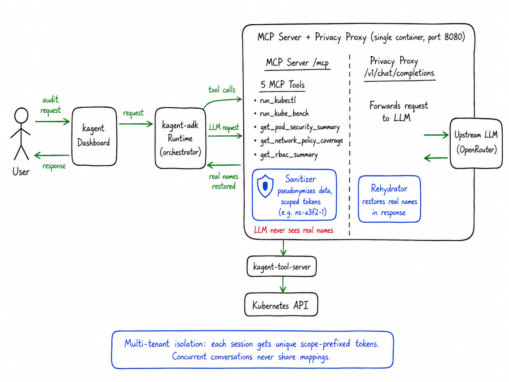

# k8s-sec-agent

A Kubernetes security audit agent running as a **declarative agent** in [kagent](https://github.com/kagent-dev/kagent). Audits clusters against CIS security benchmarks using MCP tools with privacy-preserving pseudonymization.

## Architecture



The MCP tools call the kagent-tool-server (via JSON-RPC over HTTP) to query the Kubernetes API. Raw cluster data is pseudonymized before the LLM sees it. The proxy rehydrates the LLM's response before it reaches the user.

## Tools

| Tool | Description |
|------|-------------|
| `run_kube_bench` | Runs [kube-bench](https://github.com/aquasecurity/kube-bench) as a K8s Job for CIS node benchmark checks |
| `run_kubectl` | Executes kubectl commands via kagent-tool-server with output sanitization |
| `get_pod_security_summary` | Scans all pods for security issues (privileged, root, no limits, writable rootfs) |
| `get_network_policy_coverage` | Checks network policy coverage per namespace |
| `get_rbac_summary` | Analyzes cluster-admin bindings and overpermissive roles |

## Privacy

All tool outputs are pseudonymized before the LLM sees them. Namespace names, pod names, service accounts, IPs, secrets, and container images are replaced with scope-prefixed tokens (e.g., `ns-a3f2-1`, `pod-a3f2-3`, `ip-a3f2-7`). Real names are restored in the final output via the proxy's rehydration layer.

### Multi-tenant isolation

Each MCP session gets its own sanitizer with a unique 4-character hex scope. Tokens are globally unique across concurrent conversations — `ns-a3f2-1` and `ns-b7c8-1` can never collide. The proxy's `rehydrate_all()` resolves tokens from all active scopes, so cross-turn references work correctly.

Sanitizer state lives in-process memory only, never persisted. Idle sanitizers are evicted after 300 seconds.

## Deployment

### Prerequisites

- kagent installed in the cluster
- Secret `k8s-sec-agent-env` with `OPENAI_API_KEY` in the `kagent` namespace

### Helm (recommended)

```bash
helm install k8s-sec-agent chart/k8s-sec-agent -n kagent
```

Override values as needed:

```bash
helm install k8s-sec-agent chart/k8s-sec-agent -n kagent \
  --set image.tag=sha-abc1234 \
  --set agent.model=anthropic/claude-sonnet-4 \
  --set upstream.url=https://openrouter.ai/api/v1
```

Upgrade:

```bash
helm upgrade k8s-sec-agent chart/k8s-sec-agent -n kagent \
  --set image.tag=sha-<NEW_SHA>
```

### Debug logging

Set `LOG_LEVEL=DEBUG` to enable verbose sanitizer/proxy logging without code changes:

```bash
helm upgrade k8s-sec-agent chart/k8s-sec-agent -n kagent \
  --set extraEnv[0].name=LOG_LEVEL \
  --set extraEnv[0].value=DEBUG
```

## Development

The image is built and pushed automatically via GitHub Actions on push to `main`.

## Project Structure

```
k8s_sec_agent/
  main.py                 # Combined ASGI app (MCP + proxy)
  mcp_server.py           # FastMCP server exposing 5 audit tools
  proxy.py                # OpenAI-compatible reverse proxy with rehydration
  sanitizer/
    __init__.py           # Public API re-exports
    core.py               # K8sSanitizer — pseudonymization + rehydration
    manager.py            # SanitizerManager — multi-tenant session registry
  tools/
    __init__.py
    k8s_client.py         # JSON-RPC client for kagent-tool-server
    kube_bench.py         # CIS benchmark via kube-bench Job
    kubectl.py            # General kubectl execution with command parsing
    pod_security.py       # Pod security context analysis
    network_policy.py     # Network policy coverage
    rbac.py               # RBAC analysis
chart/k8s-sec-agent/      # Helm chart
  Chart.yaml
  values.yaml             # All configurable values (model, prompt, tools, etc.)
  templates/
Dockerfile
pyproject.toml
```
